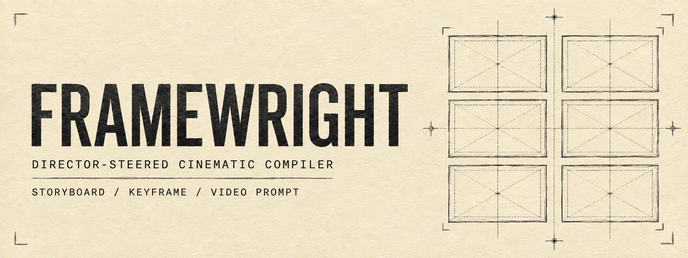
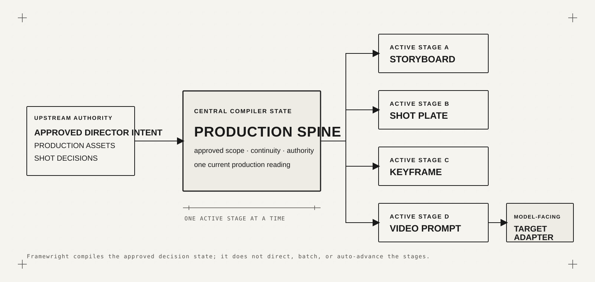

# Framewright

> A director-steered, asset-aware, intent-preserving cinematic compiler for AI filmmaking.

**You direct. Framewright compiles.**

Framewright turns approved director intent, production assets, and shot decisions into structured storyboard, Shot Plate, Keyframe, and video-generation prompts. It keeps the director's creative authority intact: story, blocking, performance, framing, aesthetics, and final production decisions remain human decisions.

Framewright is not a one-click filmmaking system and it is not an autonomous AI director. It is a production tool for translating a resolved creative direction into clear, model-facing artifacts.

`v4.1.1` · Codex Skill · Source available

## What is Framewright?

Most prompt workflows begin with syntax. Framewright begins with a director's approved reading of a scene.

It organizes intent, assets, shot decisions, continuity, and reference authority into a recoverable Production Spine. From that shared state, it compiles one active stage at a time into a storyboard, Shot Plate, Keyframe, or video-generation prompt. The output is structured enough to use in production while leaving room for the filmmaker's judgment.

## You direct. Framewright compiles.

| You decide | Framewright handles |
| --- | --- |
| Story and meaning | Intent preservation |
| Blocking and performance | Production-state organization |
| Shot design and framing | Reference authority |
| Aesthetic choices | Continuity checks |
| Final production decisions | Prompt compilation and target-model adaptation |

The compiler can clarify, organize, and serialize a decision. It does not become the author of that decision.

## How it works

Framewright does not treat production artifacts as a forced funnel. A single approved Production Spine can be compiled into the artifact needed at the current stage, while the stages remain independent.

Completing one stage may inform a later stage, but it never starts that stage automatically. The target adapter serializes an approved prompt for a model; it does not direct the scene.

## Current model routes

These are the registered Framewright 4.1.1 routes. A route is selected for the active artifact and operation; unlisted models are not implied to be supported.

### Image

| Artifact | Default create | Alternative create | Edit |
| --- | --- | --- | --- |
| Storyboard | ChatGPT Image 2 | — | ChatGPT Image 2 |
| Shot Plate | Midjourney V8.2 | ChatGPT Image 2 | ChatGPT Image 2 |
| Keyframe | Midjourney V8.2 | ChatGPT Image 2 | ChatGPT Image 2 |

### Video

| Artifact | Supported target routes |
| --- | --- |
| Video Prompt | Seedance 2.0 · Seedance 2.5 · MiniMax H3 |

Framewright compiles prompts for these registered routes. It does not bundle or require an external Seedance skill pack.

## Quick Start

1. Install `skill/framewright/` as a Codex Skill.
2. Invoke it with `$framewright`.
3. Give it a scene, screenplay fragment, or visual brief.
4. Resolve the director intent and production reading.
5. Choose one active stage and compile it.

Start with the result you need now. Learn the deeper Production Spine structure as your project becomes more complex.

## Personal by design

Framewright grew out of my own filmmaking practice. It is not intended to define a universal way to make films with AI.

Use it as-is, study its logic, or adapt its defaults, adapters, and heuristics to fit the way you direct. Treat it less like a standard and more like a tuned instrument.

## Design principles

- The director stays in control.
- Intent comes before syntax.
- One active stage runs at a time.
- Assets carry explicit authority.
- The compiler should know when to stop.
- Model-specific adapters serialize; they do not direct.

## Installation

Install the stable Skill from the [`skill/framewright/`](skill/framewright/) directory, or from the [Framewright `main` branch on GitHub](https://github.com/jamesltr0701-cell/framewright/tree/main/skill/framewright).

After installation, invoke the Skill explicitly with `$framewright`.

## Repository structure

- [`skill/framewright/`](skill/framewright/) — installable Codex Skill
- [`skill/framewright/references/framewright.md`](skill/framewright/references/framewright.md) — authoritative Framewright specification
- [`skill/framewright/references/runtime_profiles/`](skill/framewright/references/runtime_profiles/) — target-versioned Video Prompt adapters
- [`skill/framewright/references/keyframe_profiles/`](skill/framewright/references/keyframe_profiles/) — image creation and editing adapters
- [`skill/framewright/references/craft/`](skill/framewright/references/craft/) — on-demand camera, identity/material, light/sound, and repair guidance
- [`versions/releases/`](versions/releases/) — immutable, version-numbered release snapshots
- [`versions/iterations/`](versions/iterations/) — preserved development iterations
- [`versions/beta/`](versions/beta/) — preserved historical beta experiments
- [`docs/product-vision.md`](docs/product-vision.md) — clean-room product evaluation brief

## Versioning and development

GitHub `main` is the source of truth for the synchronized stable release. The canonical specification is versioned in [`skill/framewright/references/framewright.md`](skill/framewright/references/framewright.md); the matching immutable 4.1.1 snapshot is [`versions/releases/framewright-v4.1.1.md`](versions/releases/framewright-v4.1.1.md).

Promoted releases preserve older snapshots. Experimental candidates may remain isolated on local branches and do not become stable releases until separately approved. Desktop mirror and local-install synchronization are maintainer concerns; they do not change the public Skill interface.

## License, attribution, and third-party notices

Framewright is **source available**, not “open source” in the OSI sense. The proposed license for original Framewright material is the Apache License 2.0 with the Commons Clause License Condition v1.0. It is intended to keep Framewright free to use, study, modify, fork, and integrate into a larger creative workflow, while restricting the sale of Framewright itself or a product or service whose value derives entirely or substantially from Framewright's functionality.

The license and attribution files in this release package are drafts for human legal review and are not legal advice:

- [`LICENSE`](LICENSE) — proposed Apache 2.0 + Commons Clause terms for original Framewright material
- [`NOTICE`](NOTICE) — Framewright authorship and redistribution attribution
- [`THIRD_PARTY_NOTICES.md`](THIRD_PARTY_NOTICES.md) — required notice for identified adapted MIT material

Redistributing the Framewright source or Skill should preserve the project attribution and applicable notices. Using Framewright to make a film, advertisement, or other creative work does not require Tairan Li to be credited in the final work's credits.

Certain third-party adapted materials remain subject to their original licenses. See [`THIRD_PARTY_NOTICES.md`](THIRD_PARTY_NOTICES.md) and the related [craft provenance record](skill/framewright/references/craft/PROVENANCE.md).

Release-presentation structure, briefs, and the final readiness checklist live in [`docs/public-release/`](docs/public-release/).
